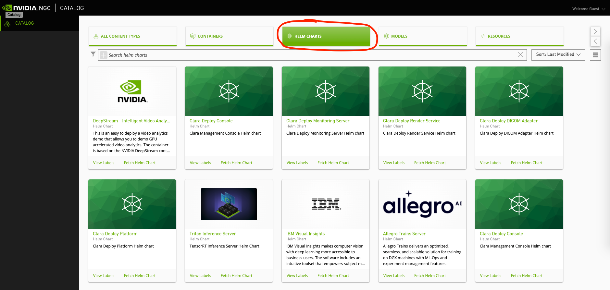
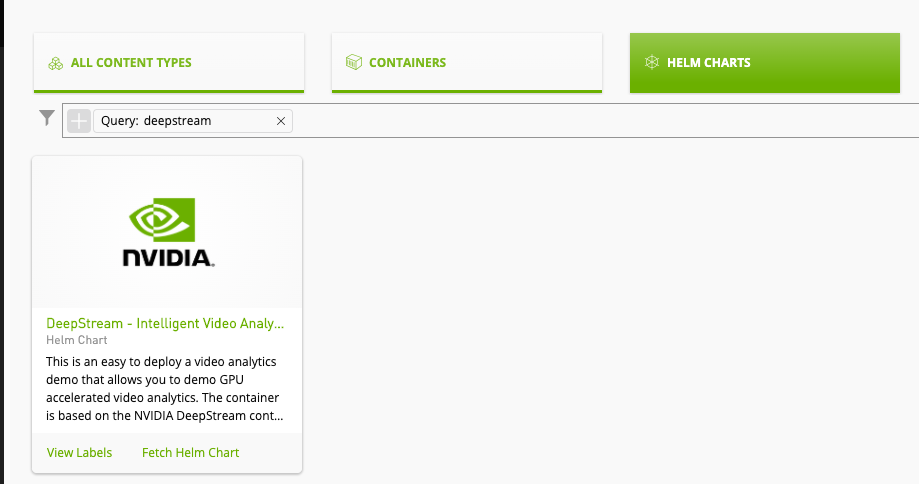
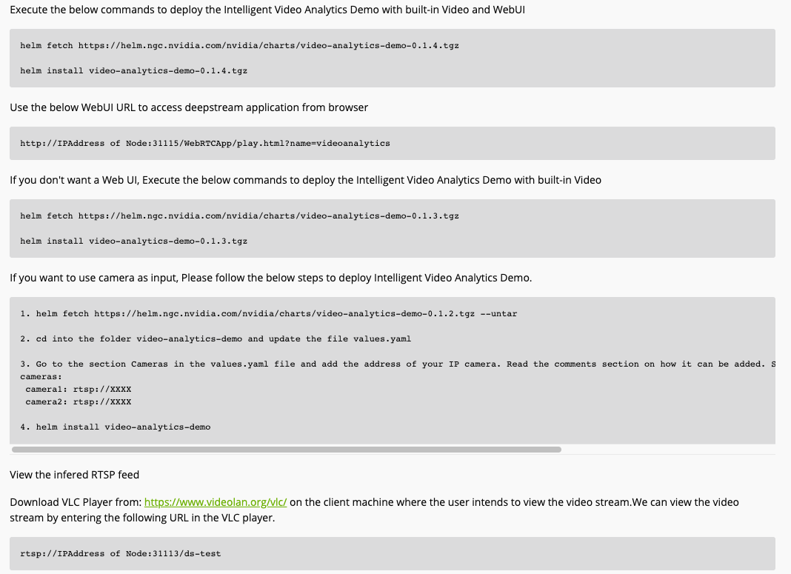
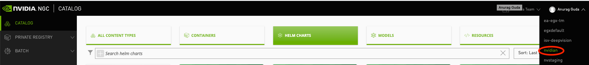
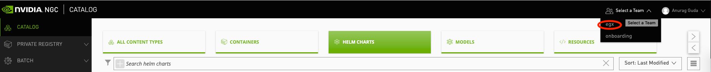
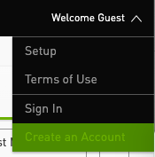
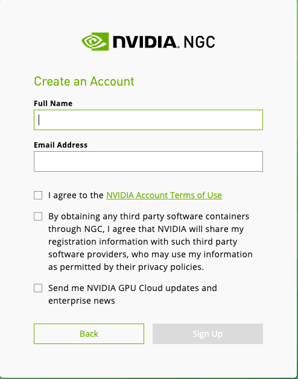
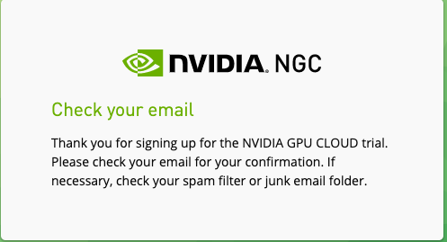
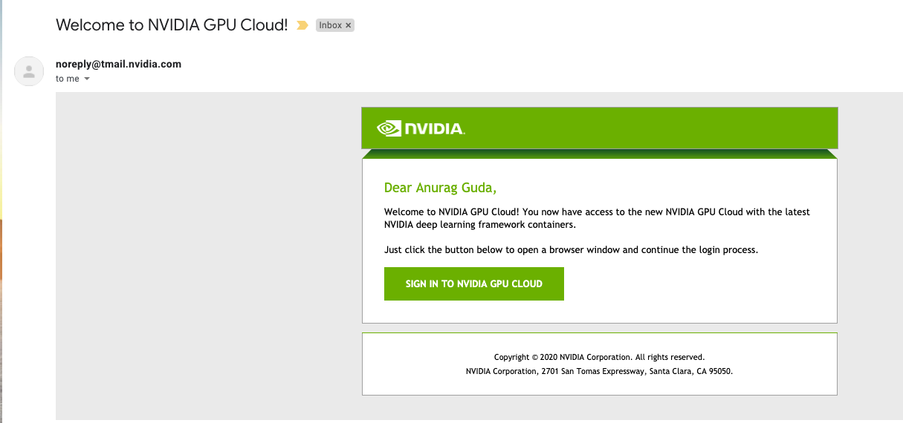
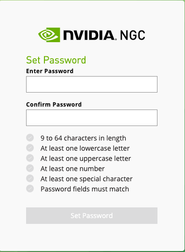

<h1>NGC Registry Guide</h1>
<h2>Introduction</h2>

This document describes how to deploy an application from NGC Registry, how to set up a NGC account, and how to create a NGC Private Registry. Please visit the [official NGC documentation](https://docs.nvidia.com/ngc) for more information

<h2>Table of Contents</h2>

- [Deploy an Application From NGC](#Deploy-an-Application-From-NGC-Catalog)
  - [Add Helm Chart to NGC](#Add-a-Helm-Chart-to-NGC-Private-Registry)
- [Setup NGC Account](#Setup-NGC-Account)
- [NGC Private Registry](#NGC-Private-Registry)

## Deploy an Application from NGC Catalog

The Below instructions are based on the assumption that you have a NVIDIA Certified System for Edge Server with the NVIDIA Cloud Native Stack installed. If not, please refer to the [NVIDIA Cloud Native Stack](https://github.com/NVIDIA/cloud-native-stack)

First, Go to https://ngc.nvidia.com. 

A NGC account is not required to browse the catalog of Containers, Helm Charts, Models, and Resources.

If you have a NGC account and want to sign in, click `Sign In` from the top menu and sign into your account. If you don't have a NGC Account, please refer the [Setup NGC Account](#Setup-NGC-Account)



You can find multiple Helm Charts under the Helm Chart Tab.  If you already know the Helm Chart name, you can search the chart name in the Search query as per below. If you don't know the Helm Chart name, you can scroll the WebUI to find the right Helm Chart. 



Once you find the right Helm Chart on NGC, click on the Helm chart to access the Helm Chart detail view and  get instructions on how to deploy the Helm Chart on NVIDIA Cloud Native Stack.

In this Helm Chart, you can see proper instructions on the DeepStream Helm Chart overview section such as how can you deploy a Helm Chart and how can you view the application as per below. 



If you don't see any instructions in the overview section, run the below commands with Helm Chart Name and Helm Chart Version to install the Chart on NVIDIA Cloud Native Stack. 

```
$ helm fetch https://helm.ngc.nvidia.com/nvidia/charts/ChartName-Version.tgz

$ helm install ChartName-Version.tgz
```

### Add a Helm Chart to NGC Private Registry

The Below instructions are based on the assumption that you've a NGC Private Registry if not please refer to [NGC Private Registry](#NGC-Private-Registry). The instructions assume that you have Helm installed on your machine. 

- Obtain a NGC API Key from [NGC](https://ngc.nvidia.com/setup/api-key)
- Run the below command to export the API Key for future use. Replace <your-api-key> with your personal API key
  ```
  $ export NGC_API_KEY=<your-api-key>
  ```
- Add the NGC org to your Helm repository with below command, Where <repo-name> is a name of your choosing by which you will reference the repository and <org-name> is a name of your NGC Organization and <team-name> is a name of your  NGC Organization Team like below.
  
  

  

  ```
  $ helm repo add <repo-name> https://helm.ngc.nvidia.com/<org-name>/<team-name> --username=\$oauthtoken --password=$NGC_API_KEY
  ```
- To download (or "fetch") a Helm Chart package from the repo, run the below command.
  ```
  $ helm fetch https://helm.ngc.nvidia.com/nvidia/charts/video-analytics-demo-0.1.8.tgz
  ```
- Run the below command to install the Helm push plugin
  ```
  $ helm plugin install https://github.com/chartmuseum/helm-push.git
  ```
  `NOTE:` The Helm push plugin does not support Helm v3 yet - make sure you are using v2.16.x.
- To push (upload) a Helm Chart to your org space, run the below command. Where <repo-name> is the name of the helm repository created for your organization's private registry.
  ```
  $ helm push video-analytics-demo-0.1.8.tgz <repo-name>
  ```

#### Deploy a Helm Chart from NGC Private Registry

Run the below command to install the Helm Chart from your private repository, where  <org-name> is a name of your NGC Private Registry. 

```
$  helm fetch https://helm.ngc.nvidia.com/<org-name>/charts/ChartName-Version.tgz --username='$oauthtoken' --password=$NGC_API_KEY

$ helm install ChartName-Version.tgz
```

## Setup NGC Account

### Access to NGC 
There are three ways to access software on NGC. 

`Guest Access:` Content under guest access does not require users to register or sign-in to pull or download the software. 

The majority of software on the NGC Catalog falls under guest access. However, it is important to note that many third party applications require a license key which can be sourced directly from ISVs. So while pulling the container from the NGC Catalog does not require sign-in, a user might have to reach out to an ISV to obtain a license key for further use. 

`Authenticated Access:` Software under authenticated access requires a user to create an [NVIDIA NGC account](https://ngc.nvidia.com/signin) or [sign-in](https://ngc.nvidia.com/signin) to the NGC Catalog. Pulling or downloading the software requires the use of their API key.

`Approved Access:` To access the software under this category, the publisher must grant user approval. Instructions to request access are provided in the overview section of the respective software. Once access is granted, the user will receive a notification with further instructions for accessing the software. 

### Register and Activate Account

This section describes how to register and activate your NGC account.

1. Go to the [NGC catalog landing page](http://ngc.nvidia.com/), click on "Create an Account" on the top Right menu.



2. Enter your full name and your email address. Check the boxes to agree to the NVIDIA Account Terms of use (mandatory), consent on sharing your registration data with partners (optional), and to receive news and updates on NVIDIA Software (optional). 



3. You receive an email to verify your registration. Click the link in the email to continue the login process.






4. You are asked to set a password.



5. Accept the NVIDIA GPU Cloud terms of use and signs into the NGC catalog.

Congratulations Your Nvidia Account Setup has been Completed. 

### Generate your NGC API key

This section describes how to obtain an API key to access locked container images from the NGC Registry.
1. Sign in to the NGC website. From a browser, go to https://ngc.nvidia.com/signin/email and then enter your email and password.
2. In the top right corner, click your user account icon and select Setup
  
  

3. Click Get API key to open the Setup > API Key page.
   The API Key is the mechanism used to authenticate your access to the NGC container registry.
4. Click Generate API Key to generate your API key. A warning message appears to let you know that your old API key will become invalid if you create a new key.
5. Click Confirm to generate the key.
   Your API key appears.
   You only need to generate an API Key once. NGC does not save your key, so store it in a secure place. (You can copy your API Key to the clipboard by clicking the copy icon to the right of the API key. )
   If you lose your API Key, you can generate a new one from the NGC website. When you generate a new API Key, the old one is invalidated.

## NGC Private Registry	
As data scientists build custom content, storing, sharing, and versioning of this valuable intellectual property is critical to meet their company’s business needs. To address these needs, NVIDIA has developed the NGC private registry to provide a secure space to store and share custom containers, models, model scripts, and Helm charts within your enterprise. The NGC Private registry is available to both the customers of DGX and NGC-Support services. 

### NGC Support Services

NGC Support Services provides enterprise-grade support to ensure optimal performance and maximized system utility for NVIDIA Certified System. The support service is purchased through NVIDIA's OEM partners. The service gives enterprise customers direct phone access to NVIDIA's subject matter experts to quickly address L1 through L3 software issues during local business hours or via web and email. This support for open source AI software combined with the OEM's hardware support gives enterprises to build optimized AI solutions at scale, minimize system downtime and accelerate their time to solution. 

NGC support services cover machine learning, deep learning and inference containers available from NGC, running on both bare metal or virtual machines. Support is also provided for CUDA and associated drivers. Below is the breakdown of the various softwares that are covered under the contract. The OEM partner is typically responsible for providing support at the hardware and OS level with additional support for container orchestration tools. 

The NGC Private registry is included as part of the support subscription providing customers with a secure location to save their custom content. 

### DGX Customers
After purchasing a support entitlement with NVIDIA, the end-customer will receive an NVIDIA Entitlement Certificate via email. The email will include all the pertinent instructions needed to to register for technical support. 

