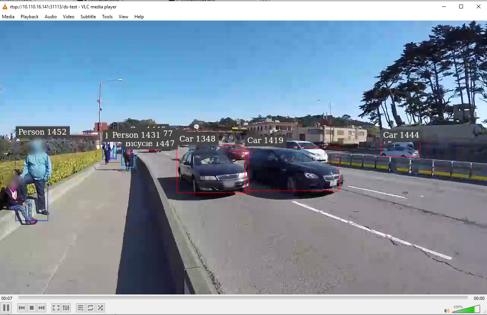

# NVIDIA Cloud Native Stack v16.0 - Install Guide for Developers
## Introduction

NVIDIA Cloud Native Stack for Developers is focused to provide the Docker based experince. This document describes how to setup the NVIDIA Cloud Native Stack collection on a single or multiple systems. NVIDIA Cloud Native Stack can be configured to create a single node Kubernetes cluster or to create/add additional worker nodes to join an existing cluster.

NVIDIA Cloud Native Stack v16.0 includes:
- Ubuntu 24.04 LTS
- Containerd 2.1.3
- Kubernetes version 1.33.2
- Helm 3.18.3
- NVIDIA GPU Driver: 580.82.07
- NVIDIA Container Toolkit: 1.17.8
- NVIDIA GPU Operator 25.3.4
  - NVIDIA K8S Device Plugin: 0.17.2
  - NVIDIA DCGM-Exporter: 4.2.3-4.1.3
  - NVIDIA DCGM: 4.2.3-1
  - NVIDIA GPU Feature Discovery: 0.17.2
  - NVIDIA K8s MIG Manager: 0.12.1
  - Node Feature Discovery: 0.17.3
  - NVIDIA KubeVirt GPU Device Plugin: 1.3.1
  - NVIDIA GDS Driver: 2.20.5
  - NVIDIA Kata Manager for Kubernetes: 0.2.3
  - NVIDIA Confidential Computing Manager for Kubernetes: 0.1.1

## Table of Contents

- [Prerequisites](#Prerequisites)
- [Installing the Ubuntu Operating System](#Installing-the-Ubuntu-Operating-System)
- [Installing NVIDIA Driver](#Installing-NVIDIA-Driver)
- [Installing Docker and Nvidia Container Toolkit](#Installing-Docker-and-Nvidia-Container-Toolkit)
- [Update the Docker Default Runtime](#Update-the-Docker-Default-Runtime)
- [Installing Container Runtime](#Installing-Container-Runtime)
  - [Installing Containerd](#Installing-Containerd)
  - [Installing CRI-O](#Installing-CRI-O)
- [Installing Kubernetes](#Installing-Kubernetes)
- [Installing Helm](#Installing-Helm)
- [Adding an Additional Node to NVIDIA Cloud Native Stack](#Adding-additional-node-to-NVIDIA-Cloud-Native-Stack)
- [Installing the GPU Operator](#Installing-the-GPU-Operator)
- [Validating the GPU Operator](#Validating-the-GPU-Operator)
- [Build Docker Images and Deploy on Cloud Native Stack](#Build-Docker-Images-and-Deploy-on-Cloud-Native-Stack) 
- [Validate NVIDIA Cloud Native Stack with an Application from NGC](#Validate-NVIDIA-Cloud-Native-Stack-with-an-application-from-NGC)
- [Uninstalling the GPU Operator](#Uninstalling-the-GPU-Operator)

### Prerequisites
 
The following instructions assume the following:

- You have [NVIDIA-Certified Systems](https://docs.nvidia.com/ngc/ngc-deploy-on-premises/nvidia-certified-systems/index.html) with Mellanox CX NICs for x86-64 servers 
- You have [NVIDIA Qualified Systems](https://www.nvidia.com/en-us/data-center/data-center-gpus/qualified-system-catalog/?start=0&count=50&pageNumber=1&filters=eyJmaWx0ZXJzIjpbXSwic3ViRmlsdGVycyI6eyJwcm9jZXNzb3JUeXBlIjpbIkFSTS1UaHVuZGVyWDIiLCJBUk0tQWx0cmEiXX0sImNlcnRpZmllZEZpbHRlcnMiOnt9LCJwYXlsb2FkIjpbXX0=) for arm64 servers 
  `NOTE:` For ARM systems, NVIDIA Network Operator is not supported yet. 
- You will perform a clean install.

To determine if your system qualifies as an NVIDIA Certified System, review the list of NVIDIA Certified Systems [here](https://docs.nvidia.com/ngc/ngc-deploy-on-premises/nvidia-certified-systems/index.html). 

Please note that NVIDIA Cloud Native Stack is validated only on systems with the default kernel (not HWE).

### Installing the Ubuntu Operating System
These instructions require having Ubuntu Server LTS 24.04 on your system. The Ubuntu Server can be downloaded from http://cdimage.ubuntu.com/releases/24.04/release/.

For more information on installing Ubuntu server please reference the [Ubuntu Server Installation Guide](https://ubuntu.com/tutorials/tutorial-install-ubuntu-server#1-overview).

### Installing NVIDIA Driver 
Install NVIDIA TRD Driver

```
sudo apt update 
```
```
wget https://developer.download.nvidia.com/compute/cuda/repos/ubuntu2204/x86_64/cuda-keyring_1.1-1_all.deb
```
```
sudo dpkg -i cuda-keyring_1.1-1_all.deb
```

Update package index:

```
sudo apt update
```

Install Cuda Drivers

```
sudo apt install cuda -y
```

Once the NVIDIA Drivers installed, please reboot the system and run the below command to validate NVIDIA drivers are loaded 

```
nvidia-smi
```

Expected Output:

```
Mon Mar 31 20:39:28 2025
+-----------------------------------------------------------------------------------------+
| NVIDIA-SMI 580.82.07             Driver Version: 580.82.07     CUDA Version: 12.8     |
|-----------------------------------------+------------------------+----------------------+
| GPU  Name                 Persistence-M | Bus-Id          Disp.A | Volatile Uncorr. ECC |
| Fan  Temp   Perf          Pwr:Usage/Cap |           Memory-Usage | GPU-Util  Compute M. |
|                                         |                        |               MIG M. |
|=========================================+========================+======================|
|   0  NVIDIA A100-SXM4-80GB          On  |   00000000:03:00.0 Off |                    0 |
| N/A   29C    P0             50W /  275W |       1MiB /  81920MiB |      0%      Default |
|                                         |                        |             Disabled |
+-----------------------------------------+------------------------+----------------------+

+-----------------------------------------------------------------------------------------+
| Processes:                                                                              |
|  GPU   GI   CI              PID   Type   Process name                        GPU Memory |
|        ID   ID                                                               Usage      |
|=========================================================================================|
|  No running processes found                                                             |
+-----------------------------------------------------------------------------------------+

```

### Installing Docker and NVIDIA Container Runtime

#### Installing Docker-CE

Set up the repository and update the apt package index:

```
sudo apt update
```

Install packages to allow apt to use a repository over HTTPS:

```
sudo apt install -y \
    apt-transport-https \
    ca-certificates \
    curl \
    gnupg-agent \
    software-properties-common
```

```
sudo install -m 0755 -d /etc/apt/keyrings
```

Add Docker's official GPG key:

```
sudo curl -fsSL https://download.docker.com/linux/ubuntu/gpg -o /etc/apt/keyrings/docker.asc
```

```
sudo chmod a+r /etc/apt/keyrings/docker.asc
```
Use the following command to set up the stable repository:

```
echo \
  "deb [arch=$(dpkg --print-architecture) signed-by=/etc/apt/keyrings/docker.asc] https://download.docker.com/linux/ubuntu \
  $(. /etc/os-release && echo "$VERSION_CODENAME") stable" | \
  sudo tee /etc/apt/sources.list.d/docker.list > /dev/null
```

Install Docker Engine - Community

Update the apt package index:

```
sudo apt update
```

Install Docker Engine:

```
sudo apt-get install docker-ce docker-ce-cli containerd.io docker-buildx-plugin docker-compose-plugin
```

Verify that Docker Engine - Community is installed correctly by running the hello-world image:

```
sudo docker run hello-world
```

More information on how to install Docker can be found at https://docs.docker.com/install/linux/docker-ce/ubuntu/. 

#### Installing NVIDIA Container Toolkit

Setup the pacakge repository 

```
distribution=$(. /etc/os-release;echo $ID$VERSION_ID) \
      && curl -fsSL https://nvidia.github.io/libnvidia-container/gpgkey | sudo gpg --dearmor -o /usr/share/keyrings/nvidia-container-toolkit-keyring.gpg \
      && curl -s -L https://nvidia.github.io/libnvidia-container/$distribution/libnvidia-container.list | \
            sed 's#deb https://#deb [signed-by=/usr/share/keyrings/nvidia-container-toolkit-keyring.gpg] https://#g' | \
            sudo tee /etc/apt/sources.list.d/nvidia-container-toolkit.list
```

Update the package index

```
sudo apt update
```

Install NVIDIA Conatiner Toolkit

```
sudo apt install -y nvidia-container-toolkit=1.17.5-1
```


### Update the Docker Default Runtime


Edit the docker daemon configuration to add the following line and save the file:

```
"default-runtime" : "nvidia"
```

Example: 
```
$ sudo nano /etc/docker/daemon.json
 
{
   "runtimes": {
   	"nvidia": {
       	"path": "nvidia-container-runtime",
           "runtimeArgs": []
   	}
   },
   "default-runtime" : "nvidia"
}
```

Now execute the below commands to restart the docker daemon:
```
sudo systemctl daemon-reload && sudo systemctl restart docker
```

#### Validate docker default runtime

Execute the below command to validate docker default runtime as NVIDIA:

```
$ sudo docker info | grep -i runtime
```

Output:
```
Runtimes: nvidia runc
Default Runtime: nvidia
```


## Installing Container Runtime

You need to install a container runtime into each node in the cluster so that Pods can run there. Currently Cloud Native Stack provides below container runtimes

- [Installing Containerd](#Installing-Containerd)
- [Installing CRI-O](#Installing-CRI-O)

`NOTE:` Only install one of either `Containerd` or `CRI-O`, not both!

These steps apply to both runtimes.

Set up the repository and update the apt package index:

```
sudo apt update
```

Install packages to allow apt to use a repository over HTTPS:

```
sudo apt install -y apt-transport-https ca-certificates gnupg-agent libseccomp2 autotools-dev debhelper software-properties-common
```

Configure the `overlay` and `br_netfilter` kernel modules required by Kubernetes:

```
cat <<EOF | sudo tee /etc/modules-load.d/kubernetes.conf
overlay
br_netfilter
EOF
```

```
sudo modprobe overlay
```
```
sudo modprobe br_netfilter
```

Setup required sysctl params; these persist across reboots.
```
cat <<EOF | sudo tee /etc/sysctl.d/99-kubernetes-cri.conf
net.bridge.bridge-nf-call-iptables  = 1
net.ipv4.ip_forward                 = 1
net.bridge.bridge-nf-call-ip6tables = 1
EOF
```

Apply sysctl params without reboot
```
sudo sysctl --system
```

### Installing Containerd(Option 1)

Download the Containerd for `x86-64` system:

```
wget https://github.com/containerd/containerd/releases/download/v2.1.3/containerd-2.1.3-linux-amd64.tar.gz
```

```
sudo tar --no-overwrite-dir -C / -xzf containerd-2.1.3-linux-amd64.tar.gz
```

```
rm -rf containerd-2.1.3-linux-amd64.tar.gz
```


Download the Containerd for `ARM` system:

```
wget https://github.com/containerd/containerd/releases/download/v2.1.3/containerd-2.1.3-linux-arm64.tar.gz
```

```
sudo tar --no-overwrite-dir -C / -xzf containerd-2.1.3-linux-arm64.tar.gz
```

```
rm -rf containerd-2.1.3-linux-arm64.tar.gz
```

Install the Containerd
```
sudo mkdir -p /etc/containerd
```

```
 wget  https://raw.githubusercontent.com/NVIDIA/cloud-native-stack/master/playbooks/files/config.toml
```

```
sudo mv config.toml /etc/containerd/ && sudo sed -i 's/SystemdCgroup \= false/SystemdCgroup \= true/g' /etc/containerd/config.toml
```

```
sudo systemctl restart containerd
```

Install Runc

```
wget https://github.com/opencontainers/runc/releases/download/v1.2.6/runc.amd64
install -m 755 runc.amd64 /usr/local/sbin/runc
```

Install CNI Plugins

```
wget https://github.com/containernetworking/plugins/releases/download/v1.6.2/cni-plugins-linux-amd64-v1.6.2.tgz
sudo mkdir -p /opt/cni/bin
sudo tar -C /opt/cni/bin -xzvf cni-plugins-linux-amd64-v1.6.2.tgz
sudo systemctl restart containerd
```

For additional information on installing Containerd, please reference [Install Containerd with Release Tarball](https://github.com/containerd/containerd/blob/master/docs/cri/installation.md).

### Installing CRI-O(Option 2)

Setup the Apt repositry for CRI-O

```
OS=xUbuntu_24.04
VERSION=1.33
```
`NOTE:` VERSION (CRI-O version) is same as kubernetes major version 

```
sudo mkdir -p /usr/share/keyrings
```

```
echo "deb https://download.opensuse.org/repositories/devel:/kubic:/libcontainers:/stable/$OS/ /" | sudo tee /etc/apt/sources.list.d/devel:kubic:libcontainers:stable.list
```

```
curl -L https://download.opensuse.org/repositories/devel:/kubic:/libcontainers:/stable/$OS/Release.key | sudo gpg --dearmor -o /usr/share/keyrings/libcontainers-archive-keyring.gpg
```

```
echo "deb http://download.opensuse.org/repositories/devel:/kubic:/libcontainers:/stable:/cri-o:/$VERSION/$OS/ /" | sudo tee /etc/apt/sources.list.d/devel:kubic:libcontainers:stable:cri-o:$VERSION.list
```

```
curl -L https://download.opensuse.org/repositories/devel:kubic:libcontainers:stable:cri-o:$VERSION/$OS/Release.key | sudo gpg --dearmor -o /usr/share/keyrings/libcontainers-crio-archive-keyring.gpg
```

Install the CRI-O and dependencies 

```
sudo apt update && sudo apt install cri-o cri-o-runc cri-tools -y
```

Create OCI hook for NVIDIA Container Runtime
```
nano /usr/share/containers/oci/hooks.d/oci-nvidia-hook.json
```

```
{
  "version": "1.0.0",
  "hook": {
    "path": "/usr/bin/nvidia-container-runtime-hook",
    "args": [
      "nvidia-container-runtime-hook",
      "prestart"
    ],
    "env": [
      "PATH=/usr/local/sbin:/usr/local/bin:/usr/sbin:/usr/bin:/sbin:/bin"
    ]
  },
  "when": {
    "always": true,
    "commands": [
      ".*"
    ]
  },
  "stages": [
    "prestart"
  ]
}
```


Enable and Start the CRI-O service 

```
sudo systemctl enable crio.service && sudo systemctl start crio.service
```

### Installing Kubernetes 

Make sure your container runtime has been started and enabled before beginning installation:

```
 sudo systemctl start containerd && sudo systemctl enable containerd
```

Execute the following to add apt keys:

```
 sudo apt update && sudo apt install -y apt-transport-https ca-certificates curl gpg
```

```
curl -fsSL https://pkgs.k8s.io/core:/stable:/v1.33/deb/Release.key | sudo gpg --dearmor -o /etc/apt/keyrings/kubernetes-apt-keyring.gpg
sudo chmod 644 /etc/apt/keyrings/kubernetes-apt-keyring.gpg
```

```
 sudo mkdir -p  /etc/apt/sources.list.d/
```

Create kubernetes.list:

```
echo 'deb [signed-by=/etc/apt/keyrings/kubernetes-apt-keyring.gpg] https://pkgs.k8s.io/core:/stable:/v1.33/deb/ /' | sudo tee /etc/apt/sources.list.d/kubernetes.list
sudo chmod 644 /etc/apt/sources.list.d/kubernetes.list 
```

Now execute the below to install kubelet, kubeadm, and kubectl:

```
 sudo apt update
```
```
 sudo apt install -y -q kubelet=1.33.2-1.1  kubectl=1.33.2-1.1  kubeadm=1.33.2-1.1 
```
```
 sudo apt-mark hold kubelet kubeadm kubectl
```

Create a kubelet default with your container runtime:

`NOTE:`  The container runtime endpoint will be `unix:/run/containerd/containerd.sock` or `unix:/run/crio/crio.sock` depending on which container runtime you chose in the previous steps.

For `Containerd` system:

```
 cat <<EOF | sudo tee /etc/default/kubelet
KUBELET_EXTRA_ARGS=--cgroup-driver=systemd --runtime-request-timeout=15m --container-runtime-endpoint="unix:/run/containerd/containerd.sock"
EOF
```

For `CRI-O` system:

```
cat <<EOF | sudo tee /etc/default/kubelet
KUBELET_EXTRA_ARGS=--cgroup-driver=systemd --runtime-request-timeout=15m --container-runtime-endpoint="unix:/run/crio/crio.sock"
EOF
```

Reload the system daemon:
```
 sudo systemctl daemon-reload
```

Disable swap:
```
 sudo swapoff -a
```
```
 sudo nano /etc/fstab
```

`NOTE:` Add a # before all the lines that start with /swap. # is a comment, and the result should look something like this:

```
UUID=e879fda9-4306-4b5b-8512-bba726093f1d / ext4 defaults 0 0
UUID=DCD4-535C /boot/efi vfat defaults 0 0
#/swap.img       none    swap    sw      0       0
```

#### Initializing the Kubernetes cluster to run as a control-plane node


Execute the following command for `Containerd` systems:

```
sudo kubeadm init --pod-network-cidr=192.168.32.0/22 --cri-socket=/run/containerd/containerd.sock --kubernetes-version="v1.33.2"
```

Eecute the following command for `CRI-O` systems:

```
sudo kubeadm init --pod-network-cidr=192.168.32.0/22 --cri-socket=unix:/run/crio/crio.sock --kubernetes-version="v1.33.2"
```

Output:
```
Your Kubernetes control-plane has initialized successfully!
 
To start using your cluster, you need to run the following as a regular user:
 
  mkdir -p $HOME/.kube
  sudo cp -i /etc/kubernetes/admin.conf $HOME/.kube/config
  sudo chown $(id -u):$(id -g) $HOME/.kube/config
 
Alternatively, if you are the root user, you can run:
 
  export KUBECONFIG=/etc/kubernetes/admin.conf
 
You should now deploy a pod network to the cluster.
Run "kubectl apply -f [podnetwork].yaml" with one of the options listed at:
  https://kubernetes.io/docs/concepts/cluster-administration/addons/
 
Then you can join any number of worker nodes by running the following on each as root:
 
kubeadm join <your-host-IP>:6443 --token 489oi5.sm34l9uh7dk4z6cm \
        --discovery-token-ca-cert-hash sha256:17165b6c4a4b95d73a3a2a83749a957a10161ae34d2dfd02cd730597579b4b34
```


Following the instructions in the output, execute the commands as shown below:

```
 mkdir -p $HOME/.kube
 sudo cp -i /etc/kubernetes/admin.conf $HOME/.kube/config
 sudo chown $(id -u):$(id -g) $HOME/.kube/config
```

With the following command, you install a pod-network add-on to the control plane node. We are using calico as the pod-network add-on here:

```
 kubectl apply -f https://raw.githubusercontent.com/projectcalico/calico/v3.28.2/manifests/calico.yaml 
```

Update the Calico Daemonset 

```
kubectl set env daemonset/calico-node -n kube-system IP_AUTODETECTION_METHOD=interface=ens\*,eth\*,enc\*,enp\*
```

You can execute the below commands to ensure that all pods are up and running:

```
 kubectl get pods --all-namespaces
```

Output:

```
NAMESPACE     NAME                                       READY   STATUS    RESTARTS   AGE
kube-system   calico-kube-controllers-65b8787765-bjc8h   1/1     Running   0          2m8s
kube-system   calico-node-c2tmk                          1/1     Running   0          2m8s
kube-system   coredns-5c98db65d4-d4kgh                   1/1     Running   0          9m8s
kube-system   coredns-5c98db65d4-h6x8m                   1/1     Running   0          9m8s
kube-system   etcd-#yourhost                             1/1     Running   0          8m25s
kube-system   kube-apiserver-#yourhost                   1/1     Running   0          8m7s
kube-system   kube-controller-manager-#yourhost          1/1     Running   0          8m3s
kube-system   kube-proxy-6sh42                           1/1     Running   0          9m7s
kube-system   kube-scheduler-#yourhost                   1/1     Running   0          8m26s
```

The get nodes command shows that the control-plane node is up and ready:

```
 kubectl get nodes
```

Output:

```
NAME             STATUS   ROLES                  AGE   VERSION
#yourhost        Ready    control-plane,master   10m   v1.33.2
```

Since we are using a single-node Kubernetes cluster, the cluster will not schedule pods on the control plane node by default. To schedule pods on the control plane node, we have to remove the taint by executing the following command:

```
kubectl taint nodes --all node-role.kubernetes.io/control-plane-
```

Refer to [Installing Kubeadm](https://kubernetes.io/docs/setup/production-environment/tools/kubeadm/install-kubeadm/)
for more information.

### Installing Helm 

Execute the following command to download and install Helm 3.18.3 for `x86-64` system: 

```
wget https://get.helm.sh/helm-v3.18.3-linux-amd64.tar.gz
```

```
tar -zxvf helm-v3.18.3-linux-amd64.tar.gz
 ```
 
 ```
sudo mv linux-amd64/helm /usr/local/bin/helm
 ```

 ```
rm -rf helm-v3.18.3-linux-amd64.tar.gz linux-amd64/
```

Download and install Helm 3.18.3 for `ARM` system: 

```
wget https://get.helm.sh/helm-v3.18.3-linux-arm64.tar.gz
```

```
tar -zxvf helm-v3.18.3-linux-arm64.tar.gz
 ```
 
```
sudo mv linux-arm64/helm /usr/local/bin/helm
```

```
rm -rf helm-v3.18.3-linux-arm64.tar.gz linux-arm64/
```

Refer to the Helm 3.18.3 [release notes](https://github.com/helm/helm/releases) and the [Installing Helm guide](https://helm.sh/docs/using_helm/#installing-helm) for more information.

### Adding an Additional Node to NVIDIA Cloud Native Stack

`NOTE:` If you're not adding additional nodes, please skip this step and proceed to the next step [Installing NVIDIA Network Operator](#Installing-NVIDIA-Network-Operator)

Make sure to install the Containerd and Kubernetes packages on additional nodes.

Prerequisites: 
- [Installing Docker and NVIDIA Container Toolkit](#Installing-Docker-and-NVIDIA-Container-Toolkit)
- [Installing Containerd](#Installing-Containerd)
- [Installing Kubernetes](#Installing-Kubernetes)
- [Disable swap](#Disable-swap)

Once the prerequisites are completed on the additional nodes, execute the below command on the control-plane node and then execute the join command output on an additional node to add the additional node to NVIDIA Cloud Native Stack:

```
 sudo kubeadm token create --print-join-command
```

Output:
```
example: 
sudo kubeadm join 10.110.0.34:6443 --token kg2h7r.e45g9uyrbm1c0w3k     --discovery-token-ca-cert-hash sha256:77fd6571644373ea69074dd4af7b077bbf5bd15a3ed720daee98f4b04a8f524e
```
`NOTE`: control-plane node and worker node should not have the same node name. 

The get nodes command shows that the master and worker nodes are up and ready:

```
 kubectl get nodes
```

Output:

```
NAME             STATUS   ROLES                  AGE   VERSION
#yourhost        Ready    control-plane,master   10m   v1.33.2
#yourhost-worker Ready                           10m   v1.33.2
```

### Installing GPU Operator

Add the NVIDIA repo:

```
 helm repo add nvidia https://helm.ngc.nvidia.com/nvidia
```

Update the Helm repo:

```
 helm repo update
```

Install GPU Operator:

`NOTE:` As we are preinstalled with NVIDIA Driver and NVIDIA Container Toolkit, we need to set as `false` when installing the GPU Operator

```
 helm install --version 25.3.4 --create-namespace --namespace nvidia-gpu-operator --devel nvidia/gpu-operator --set driver.enabled=false,toolkit.enabled=false --wait --generate-name
```

#### Validating the State of the GPU Operator:

Please note that the installation of the GPU Operator can take a couple of minutes. How long the installation will take depends on your internet speed.

```
kubectl get pods --all-namespaces | grep -v kube-system
```

```
NAMESPACE                NAME                                                              READY   STATUS      RESTARTS   AGE
default                  gpu-operator-1622656274-node-feature-discovery-master-5cddq96gq   1/1     Running     0          2m39s
default                  gpu-operator-1622656274-node-feature-discovery-worker-wr88v       1/1     Running     0          2m39s
default                  gpu-operator-7db468cfdf-mdrdp                                     1/1     Running     0          2m39s
nvidia-gpu-operator      gpu-feature-discovery-g425f                                       1/1     Running     0          2m20s
nvidia-gpu-operator      nvidia-cuda-validator-s6x2p                                       0/1     Completed   0          48s
nvidia-gpu-operator      nvidia-dcgm-exporter-wtxnx                                        1/1     Running     0          2m20s
nvidia-gpu-operator      nvidia-dcgm-jbz94                                                 1/1     Running     0          2m20s
nvidia-gpu-operator      nvidia-device-plugin-daemonset-hzzdt                              1/1     Running     0          2m20s
nvidia-gpu-operator      nvidia-device-plugin-validator-9nkxq                              0/1     Completed   0          17s
nvidia-gpu-operator      nvidia-operator-validator-cw4j5                                   1/1     Running     0          2m20s

```

Please refer to the [GPU Operator page](https://ngc.nvidia.com/catalog/helm-charts/nvidia:gpu-operator) on NGC for more information.

For multiple worker nodes, execute the below command to fix the CoreDNS and Node Feature Discovery. 

```
kubectl delete pods $(kubectl get pods -n kube-system | grep core | awk '{print $1}') -n kube-system; kubectl delete pod $(kubectl get pods -o wide -n nvidia-gpu-operator | grep node-feature-discovery | grep -v master | awk '{print $1}') -n nvidia-gpu-operator
```

#### GPU Operator with MIG

`NOTE:` Only A100 and A30 GPUs are supported for GPU Operator with MIG

Multi-Instance GPU (MIG) allows GPUs based on the NVIDIA Ampere architecture (such as NVIDIA A100) to be securely partitioned into separate GPU instances for CUDA applications. For more information about enabling the MIG capability, please refer to [GPU Operator with MIG](https://docs.nvidia.com/datacenter/cloud-native/gpu-operator/gpu-operator-mig.html) 


### Validating the GPU Operator

GPU Operator validates the  through the nvidia-device-plugin-validation pod and the nvidia-driver-validation pod. If both are completed successfully (see output from kubectl get pods --all-namespaces | grep -v kube-system), NVIDIA Cloud Native Stack is working as expected. This section provides two examples of validating that the GPU is usable from within a pod to validate the  manually.

#### Example 1: nvidia-smi

Execute the following:

```
cat <<EOF | tee nvidia-smi.yaml
apiVersion: v1
kind: Pod
metadata:
  name: nvidia-smi
spec:
  restartPolicy: OnFailure
  containers:
    - name: nvidia-smi
      image: "nvidia/cuda:12.8.0-base-ubuntu24.04"
      args: ["nvidia-smi"]
EOF
```

```
kubectl apply -f nvidia-smi.yaml
```

```
kubectl logs nvidia-smi
```

Output:
``` 
Mon Mar 31 20:39:28 2025
+-----------------------------------------------------------------------------------------+
| NVIDIA-SMI 580.82.07             Driver Version: 580.82.07     CUDA Version: 12.8     |
|-----------------------------------------+------------------------+----------------------+
| GPU  Name                 Persistence-M | Bus-Id          Disp.A | Volatile Uncorr. ECC |
| Fan  Temp   Perf          Pwr:Usage/Cap |           Memory-Usage | GPU-Util  Compute M. |
|                                         |                        |               MIG M. |
|=========================================+========================+======================|
|   0  NVIDIA A100-SXM4-80GB          On  |   00000000:03:00.0 Off |                    0 |
| N/A   29C    P0             50W /  275W |       1MiB /  81920MiB |      0%      Default |
|                                         |                        |             Disabled |
+-----------------------------------------+------------------------+----------------------+

+-----------------------------------------------------------------------------------------+
| Processes:                                                                              |
|  GPU   GI   CI              PID   Type   Process name                        GPU Memory |
|        ID   ID                                                               Usage      |
|=========================================================================================|
|  No running processes found                                                             |
+-----------------------------------------------------------------------------------------+
```

#### Example 2: CUDA-Vector-Add

Create a pod YAML file:

```
$ cat <<EOF | tee cuda-samples.yaml
apiVersion: v1
kind: Pod
metadata:
  name: cuda-vector-add
spec:
  restartPolicy: OnFailure
  containers:
    - name: cuda-vector-add
      image: "k8s.gcr.io/cuda-vector-add:v0.1"
EOF
```

Execute the below command to create a sample GPU pod:

```
$ kubectl apply -f cuda-samples.yaml
```

Confirm the cuda-samples pod was created:

```
$ kubectl get pods
``` 

NVIDIA Cloud Native Stack works as expected if the get pods command shows the pod status as completed.

### Build Docker Images and Deploy on Cloud Native Stack 
You can build the docker images using docker CLI but you can not use them directly on Cloud Native Stack. Please find the below steps to import the docker image into Cloud Native Stack. 

```
sudo docker save test-image:0.1.0 > test-image.tgz; sudo ctr -n=k8s.io images import test-image.tgz
```

### Validate NVIDIA Cloud Native Stack with an Application from NGC
Another option to validate NVIDIA Cloud Native Stack is by running a demo application hosted on NGC.

NGC is NVIDIA's GPU-optimized software hub. NGC provides a curated set of GPU-optimized software for AI, HPC, and visualization. The content provided by NVIDIA and third-party ISVs simplify building, customizing, and integrating GPU-optimized software into workflows, accelerating the time to solutions for users.

Containers, pre-trained models, Helm charts for Kubernetes deployments, and industry-specific AI toolkits with software development kits (SDKs) are hosted on NGC. For more information about how to deploy an application that is hosted on NGC or the NGC Private Registry, please refer to this [NGC Registry Guide](https://github.com/NVIDIA/cloud-native-stack/blob/master/install-guides/NGC_Registry_Guide_v1.0.md). Visit the [public NGC documentation](https://docs.nvidia.com/ngc) for more information.

The steps in this section use the publicly available DeepStream - Intelligent Video Analytics (IVA) demo application Helm Chart. The application can validate the full NVIDIA Cloud Native Stack and test the connectivity of NVIDIA Cloud Native Stack to remote sensors. DeepStream delivers real-time AI-based video and image understanding and multi-sensor processing on GPUs. For more information, please refer to the [Helm Chart](https://ngc.nvidia.com/catalog/helm-charts/nvidia:video-analytics-demo).

There are two ways to configure the DeepStream - Intelligent Video Analytics Demo Application on your NVIDIA Cloud Native Stack

- Using a camera
- Using the integrated video file (no camera required)

#### Using a camera

##### Prerequisites: 
- RTSP Camera stream

Go through the below steps to install the demo application:
```
1. helm fetch https://helm.ngc.nvidia.com/nvidia/charts/video-analytics-demo-0.1.9.tgz --untar

2. cd into the folder video-analytics-demo and update the file values.yaml

3. Go to the section Cameras in the values.yaml file and add the address of your IP camera. Read the comments section on how it can be added. Single or multiple cameras can be added as shown below

cameras:
 camera1: rtsp://XXXX
```

Execute the following command to deploy the demo application:
```
helm install video-analytics-demo --name-template iva
```

Once the Helm chart is deployed, access the application with the VLC player. See the instructions below. 

#### Using the integrated video file (no camera)

If you dont have a camera input, please execute the below commands to use the default video already integrated into the application:

```
$ helm fetch https://helm.ngc.nvidia.com/nvidia/charts/video-analytics-demo-0.1.9.tgz

$ helm install video-analytics-demo-0.1.9.tgz --name-template iva
```

Once the helm chart is deployed, access the application with the VLC player as per the below instructions. 
For more information about the demo application, please refer to the [application NGC page](https://ngc.nvidia.com/catalog/helm-charts/nvidia:video-analytics-demo)

#### Access from WebUI

Use the below WebUI URL to access the video analytic demo application from the browser:
```
http://IPAddress of Node:31115/
```

#### Access from VLC

Download VLC Player from https://www.videolan.org/vlc/ on the machine where you intend to view the video stream.

View the video stream in VLC by navigating to Media > Open Network Stream > Entering the following URL:

```
rtsp://IPAddress of Node:31113/ds-test
```

You should see the video output like below with the AI model detecting objects.



`NOTE:` Video stream in VLC will change if you provide an input RTSP camera.


### Uninstalling the GPU Operator 

Execute the below commands to uninstall the GPU Operator:

```
$ helm ls
NAME                    NAMESPACE                      REVISION        UPDATED                                 STATUS          CHART                   APP VERSION
gpu-operator-1606173805 nvidia-gpu-operator            1               2025-03-31 20:23:28.063421701 +0000 UTC deployed        gpu-operator-25.3.4      v25.3.4

$ helm del gpu-operator-1606173805 -n nvidia-gpu-operator
```
